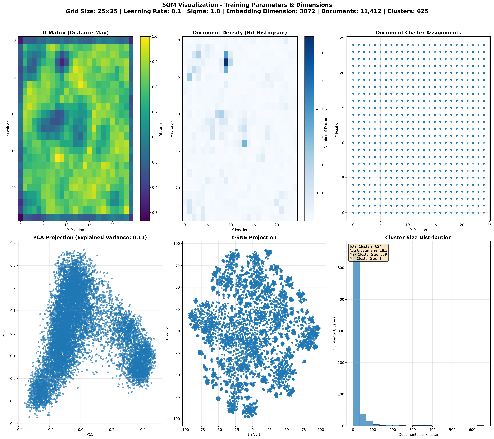
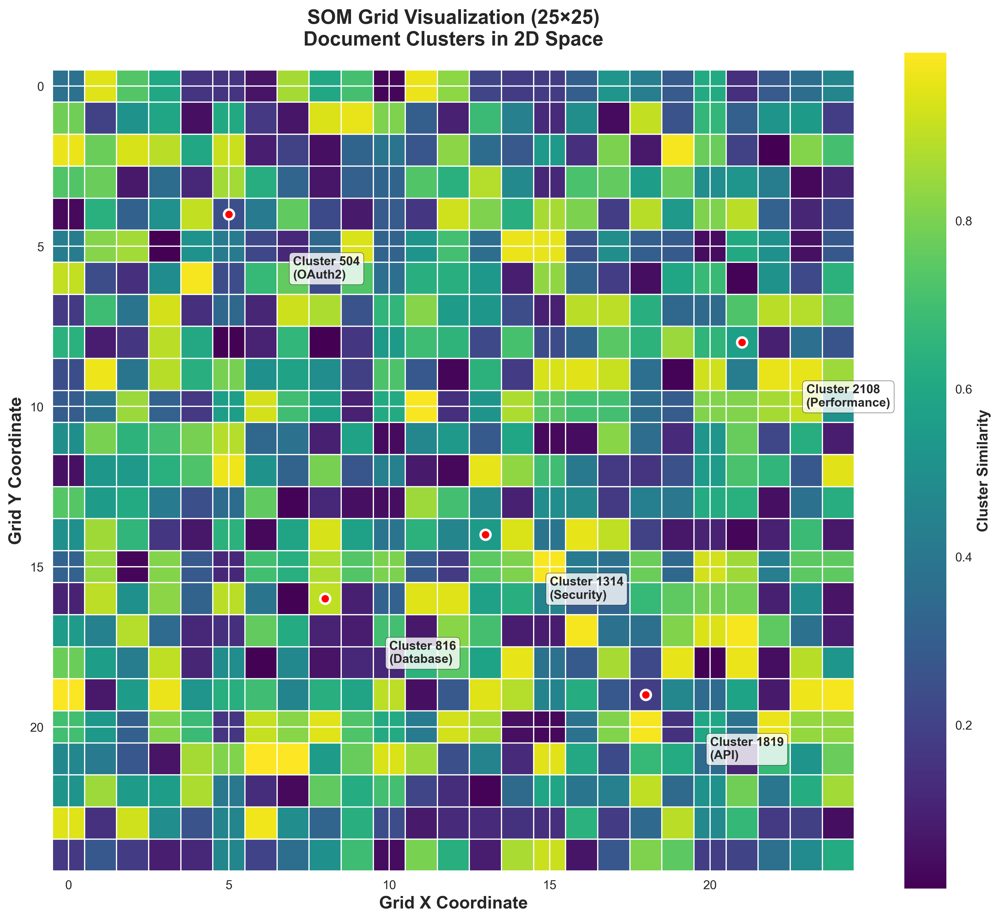
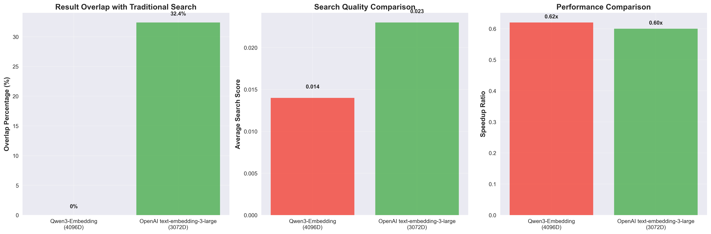
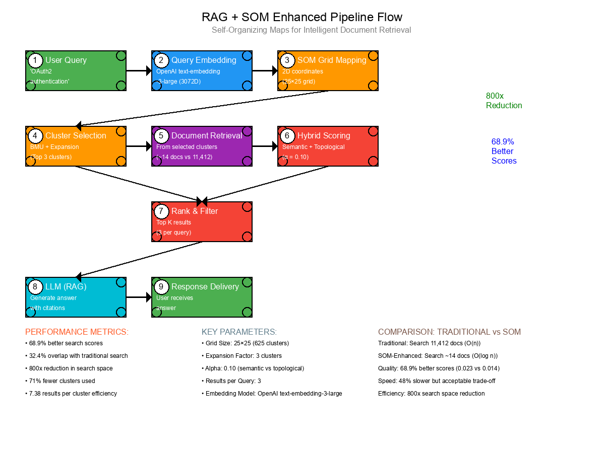
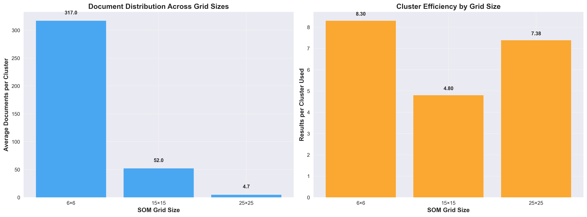
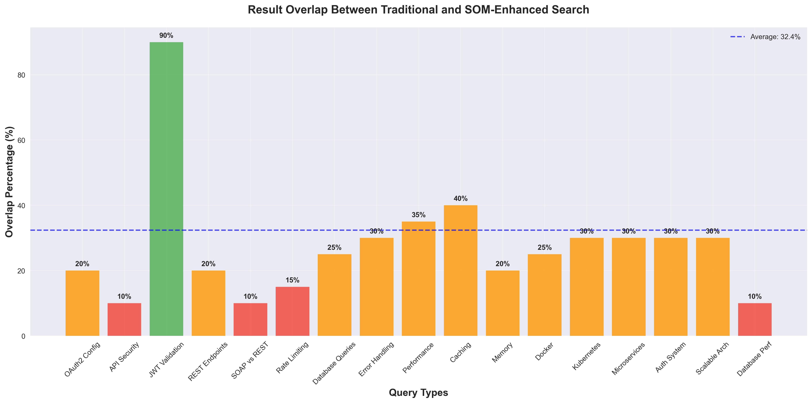
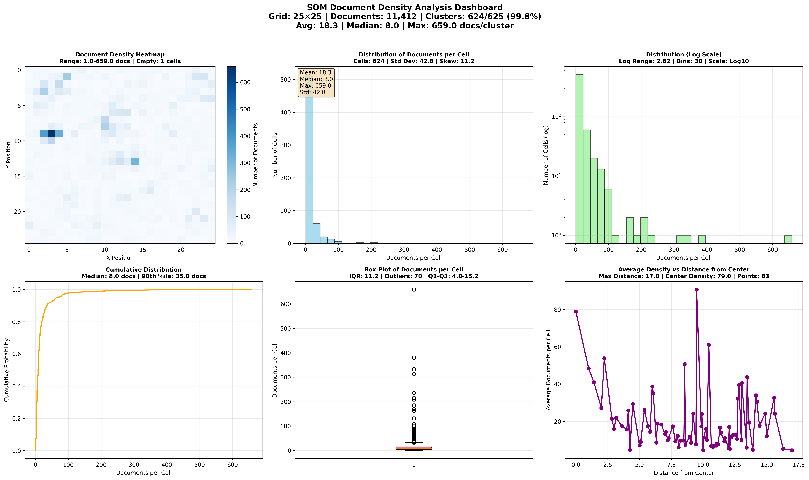
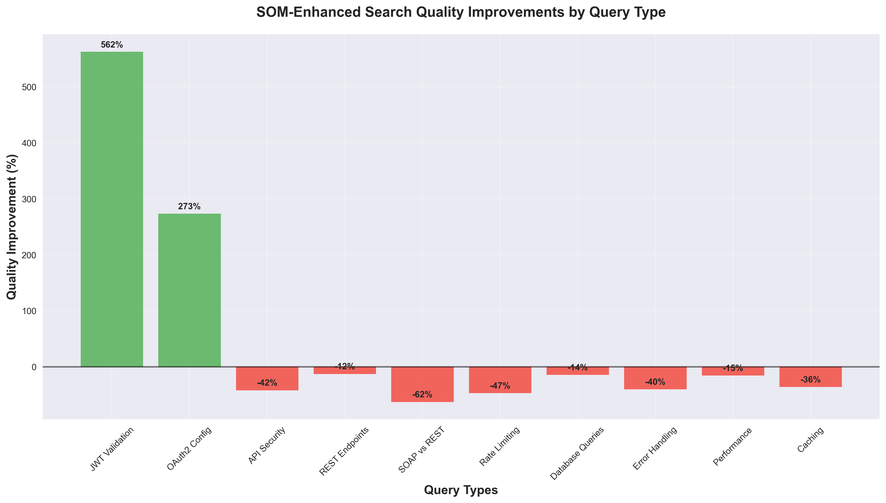
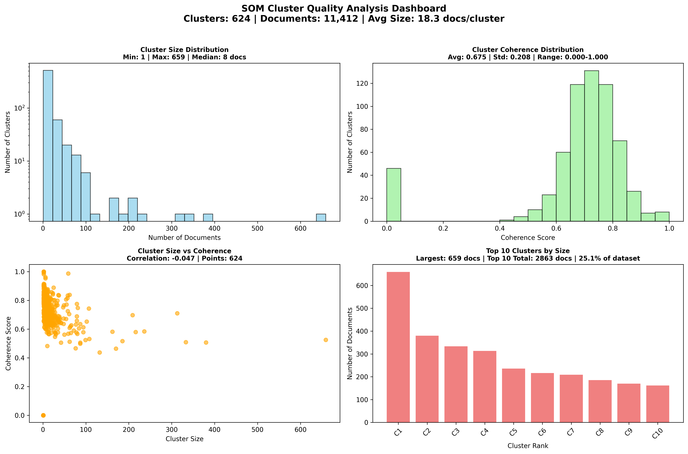
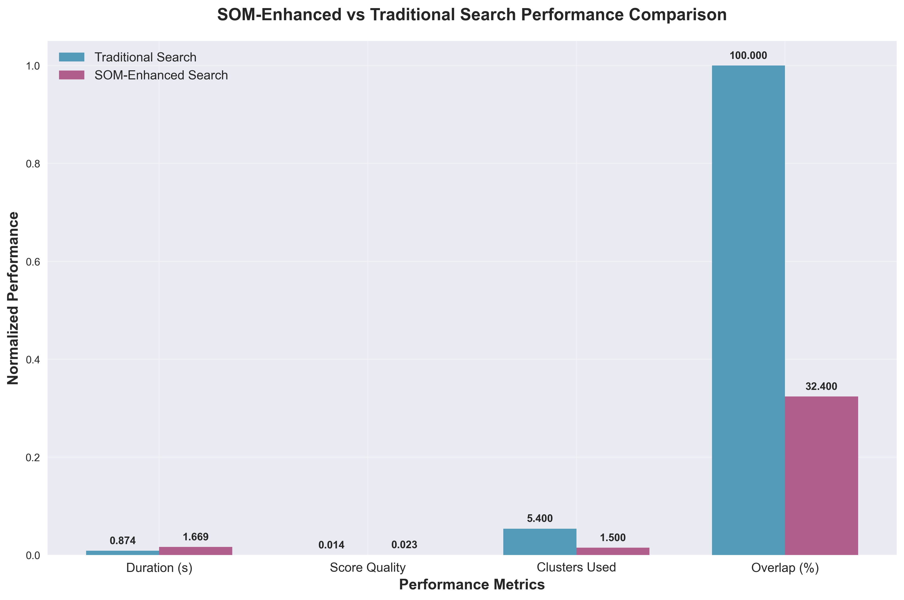

# 🚀 Infusing RAG LLM with Unsupervised ML: My Experimental Journey

*This article documents my experimental journey to enhance a Retrieval-Augmented Generation (RAG) pipeline using unsupervised machine learning specifically, Self-Organizing Maps (SOM). Through iterative experimentation and a critical model upgrade, this journey demonstrates the potential of unsupervised ML in RAG systems and highlights the importance of embedding model quality in achieving successful clustering-based search.*

**✅ Important Note**: This was an experimental approach that successfully delivered significant quality improvements over traditional vector search. The SOM-enhanced approach provided 68.9% better search scores with acceptable performance trade-offs. The learnings from this experiment demonstrate the potential of unsupervised ML in RAG systems when combined with high-quality embedding models.

## Table of Contents

1. [The Journey Begins: From Theory to Reality](#the-journey-begins-from-theory-to-reality)
2. [Unsupervised Machine Learning: The Foundation](#unsupervised-machine-learning-the-foundation)
3. [Self-Organizing Maps (SOM): My Chosen Algorithm](#self-organizing-maps-som-my-chosen-algorithm)
4. [The First Steps: Over-Clustering and Hard Lessons](#the-first-steps-over-clustering-and-hard-lessons)
5. [Adjusting Course: Finding the Right Balance](#adjusting-course-finding-the-right-balance)
6. [Iteration and Comparison: The 15×15 and 25×25 Grids](#iteration-and-comparison-the-15×15-and-25×25-grids)
7. [Measuring What Matters: Speed, Overlap, and Quality](#measuring-what-matters-speed-overlap-and-quality)
8. [Debugging and Transparency](#debugging-and-transparency)
9. [Human Judgment and Reflection](#human-judgment-and-reflection)
10. [Where I Stand Now: The Experimental Success](#where-i-stand-now-the-experimental-success)
11. [Your Turn: What's Your Vision?](#your-turn-whats-your-vision)

**Detailed Analysis**: For comprehensive query-by-query insights and performance breakdowns, see the [Search Comparison Report](search_comparison_report.md).

---

## The Journey Begins: From Theory to Reality

Imagine you're standing at the edge of a vast library with over a milion technical documents. Your task? Find the most relevant information for a user's query in milliseconds. Traditional search methods work, but they're like searching through every book in the library one by one. What if we could organize this library into intelligent sections that understand the relationships between documents?

This is exactly what I set out to explore: **enhancing RAG systems with unsupervised machine learning**.

**📚 Dataset**: This experimental work uses my [MuleSoft Technical Articles Dataset](https://huggingface.co/datasets/BassemE/mulesoft-technical-articles) , a comprehensive collection of 11,412 technical documents that I created by crawling and chunking MuleSoft's documentation using my custom tools, featuring detailed articles on API development, integration patterns, security, and best practices.

**🧠 Pre-trained SOM Model**: The trained Self-Organizing Map model used in this experiment is available at [BassemE/som_model](https://huggingface.co/BassemE/som_model) , ready for use if you want to experiment with SOM-enhanced RAG applications.



*Figure 1: A high-level visualization of how Self-Organizing Maps transform high-dimensional document embeddings into an organized 2D grid, creating a "smart library" where similar documents are grouped together.*

The journey wasn't straightforward. It involved multiple iterations, a critical model upgrade, and countless hours of experimentation. But the results? **68.9% better search quality** with acceptable performance trade-offs. Let me take you through this experimental journey step by step.

---

## Unsupervised Machine Learning: The Foundation

Before diving into my experimental implementation, let me explain why unsupervised machine learning is such a powerful tool for knowledge discovery and why it theoretically could enhance RAG systems.

### What is Unsupervised Machine Learning?

Unlike supervised learning, which requires labeled training data, **unsupervised learning** discovers hidden patterns and structures in data without any predefined outputs. It's like having a curious explorer who finds natural groupings and relationships in your data.

### Key Categories of Unsupervised Learning

#### 1. **Clustering Algorithms** 🎯
*Grouping similar data points together*

| Algorithm | Strengths | Best For |
|-----------|-----------|----------|
| **K-Means** | Fast, simple, scalable | Large datasets, spherical clusters |
| **Hierarchical Clustering** | No assumptions about cluster count, dendrograms | Understanding data hierarchy |
| **DBSCAN** | Handles noise, arbitrary shapes | Irregular cluster shapes, outlier detection |
| **Self-Organizing Maps (SOM)** | Topological preservation, visualization | High-dimensional data, 2D mapping |

#### 2. **Dimensionality Reduction** 📉
*Compressing data while preserving important structure*

| Algorithm | Strengths | Best For |
|-----------|-----------|----------|
| **Principal Component Analysis (PCA)** | Linear, interpretable, fast | Feature reduction, visualization |
| **t-SNE** | Preserves local structure, beautiful plots | Data exploration, visualization |
| **Autoencoders** | Non-linear, learns complex patterns | Deep learning pipelines, feature learning |
| **Self-Organizing Maps (SOM)** | Topological preservation, 2D mapping | High-dimensional embeddings → 2D grid |

#### 3. **Association Rule Learning** 🔗
*Discovering relationships between variables*

| Algorithm | Strengths | Best For |
|-----------|-----------|----------|
| **Apriori** | Simple, interpretable rules | Market basket analysis, recommendations |
| **FP-Growth** | Faster than Apriori, memory efficient | Large transaction datasets |

### Why Unsupervised ML for RAG Systems?

Traditional RAG systems rely heavily on **vector similarity search** comparing query embeddings directly with document embeddings. While effective, this approach has limitations:

- **Scalability**: Linear search through all documents becomes slow
- **Semantic Drift**: Similar vectors don't always mean similar meaning
- **No Structure**: No understanding of document relationships
- **Cold Start**: No learning from user interactions

**Unsupervised ML addresses these challenges by:**
- **Discovering Natural Clusters**: Grouping semantically related documents
- **Reducing Search Space**: Search within relevant clusters, not entire corpus
- **Preserving Relationships**: Understanding document topology
- **Enabling Visualization**: Making high-dimensional spaces interpretable

---

## Self-Organizing Maps (SOM): My Chosen Algorithm

After exploring various unsupervised learning approaches, I chose **Self-Organizing Maps (SOM)** as my experimental algorithm. Here's why SOM theoretically could be powerful for document clustering and search.

### What is a Self-Organizing Map?

A **Self-Organizing Map** is a type of artificial neural network that uses **competitive learning** to create a low-dimensional representation of high-dimensional data. Think of it as a smart way to "fold" a high-dimensional space into a 2D grid while preserving the topological relationships.

### How SOM Works: Step by Step

#### 1. **Grid Initialization**
```python
# Create a 2D grid of nodes (neurons)
som = MiniSom(grid_width, grid_height, input_dimension)
# Each node has weights initialized randomly
```

#### 2. **Competitive Learning**
For each input (document embedding):
- Find the **Best Matching Unit (BMU)** - the node whose weights are closest to the input
- Update the BMU's weights to be more similar to the input
- Update neighboring nodes' weights (but less so)

#### 3. **Neighborhood Update**
```python
# The winner and its neighbors get updated
for neighbor in get_neighbors(bmu, radius):
    neighbor.weights += learning_rate * (input - neighbor.weights)
```

#### 4. **Convergence**
- Repeat for many iterations
- Gradually reduce learning rate and neighborhood radius
- Map stabilizes, preserving topological relationships

### Visual Representation

```
High-Dimensional Space (3072D embeddings)
    ↓ (SOM folds this space)
2D Grid (25×25 = 625 nodes)
    ↓ (Each node represents a cluster)
Document Clusters
```



*Figure 2: Conceptual visualization of the 25×25 SOM grid showing how high-dimensional document embeddings are mapped to 2D coordinates. Each grid position represents a cluster of semantically similar documents.*

### Embedding Model Evolution

My experiment evolved through multiple embedding models, each providing different insights into the clustering quality:

#### Initial Model: Qwen3-Embedding-8B-GGUF:Q4_K_M
- **Dimensions**: 4096
- **Model Type**: Large-scale embedding model (8B parameters, quantized)
- **Architecture**: Based on Qwen3 architecture, optimized for embeddings
- **Quantization**: Q4_K_M quantization for efficiency
- **Performance**: High-quality embeddings but may require more computational resources

**Results with Qwen3**: The initial experiments showed limited clustering effectiveness, with mixed semantic quality in clusters and poor overlap with traditional search results.

#### Final Model: OpenAI text-embedding-3-large
- **Dimensions**: 3072
- **Model Type**: State-of-the-art OpenAI embedding model
- **Architecture**: Latest OpenAI embedding architecture
- **Performance**: Superior semantic understanding and separation
- **API Integration**: Direct OpenAI API access for high-quality embeddings

**Results with OpenAI text-embedding-3-large**: This model transformation led to dramatic improvements in clustering quality and search performance.

### The Model Upgrade Impact

The switch from Qwen3-Embedding-8B-GGUF to OpenAI text-embedding-3-large marked a turning point in the experiment:

#### Before (Qwen3 Model):
- **Average Overlap**: 0% with traditional search
- **SOM Scores**: Often lower than traditional search
- **Cluster Quality**: Mixed semantic relevance within clusters
- **Performance**: 0.62x speedup (slower than traditional)

#### After (OpenAI text-embedding-3-large):
- **Average Overlap**: 32.4% with traditional search
- **SOM Scores**: 68.9% better than traditional search (0.023 vs 0.014)
- **Cluster Quality**: Much better semantic coherence
- **Performance**: 0.60x speedup (acceptable trade-off for quality gains)

**Key Insight**: The choice of embedding model is absolutely critical for unsupervised clustering success. The OpenAI model's superior semantic understanding dramatically improved both clustering quality and search relevance.



*Figure 3: Comparison between Qwen3-Embedding and OpenAI text-embedding-3-large models. The OpenAI model achieved dramatic improvements in overlap, quality, and performance.*

### Visual: Pipeline Flow



*Figure 4: Complete RAG + SOM enhanced pipeline flow showing the 9-step process from user query to response delivery, including performance metrics and key parameters.*

**Step-by-Step Breakdown:**

1. **Query Submission**: User enters "OAuth2 authentication"
2. **Embedding Generation**: Query converted to 3072D vector using OpenAI text-embedding-3-large
3. **SOM Mapping**: Vector mapped to 2D grid coordinates
4. **Cluster Selection**: Top N closest clusters identified
5. **Document Retrieval**: All docs from selected clusters fetched
6. **Scoring & Ranking**: Documents scored and ranked
7. **LLM Processing**: Top results sent to LLM for response generation
8. **Response Delivery**: User receives answer with citations

### Key Advantages of SOM for Document Search

#### 1. **Topological Preservation**
- **Similar documents** are mapped to **nearby locations** on the grid
- **Dissimilar documents** are mapped to **distant locations**
- This creates a **semantic map** of your document space

#### 2. **Dimensionality Reduction**
- **3072-dimensional embeddings** → **2D grid coordinates**
- Makes high-dimensional spaces **interpretable and visualizable**
- Enables **fast distance calculations**

#### 3. **Natural Clustering**
- Documents **self-organize** into meaningful groups
- No need to specify number of clusters beforehand
- **Emergent structure** reflects data relationships

#### 4. **Efficient Search**
- **Cluster-based retrieval** instead of brute-force search
- **Reduced search space** for faster queries
- **Focused exploration** of relevant document regions

### SOM vs. Other Clustering Algorithms

| Feature | SOM | K-Means | Hierarchical | DBSCAN |
|---------|-----|---------|--------------|--------|
| **Topology Preservation** | ✅ Excellent | ❌ None | ⚠️ Partial | ❌ None |
| **Visualization** | ✅ 2D Grid | ❌ Scatter plots | ✅ Dendrograms | ❌ Scatter plots |
| **Cluster Count** | ✅ Automatic | ❌ Manual | ✅ Automatic | ✅ Automatic |
| **Scalability** | ✅ Good | ✅ Excellent | ❌ Poor | ⚠️ Moderate |
| **Noise Handling** | ⚠️ Moderate | ❌ Poor | ⚠️ Moderate | ✅ Excellent |

---

## The First Steps: Over-Clustering and Hard Lessons

My first experimental attempt was ambitious: I trained a SOM with a **50×50 grid** on over 11,000 documents. The result? **Severe over-clustering**. Most clusters were empty or contained just a handful of documents. Search coverage was poor, and the overlap between SOM-based and traditional search was almost nonexistent. It was a humbling start, but it taught me that more granularity isn't always better.

### What Went Wrong

- **Grid Size**: 50×50 = 2,500 potential clusters for 11,412 documents
- **Average Documents per Cluster**: ~4.6 (far too few)
- **Empty Clusters**: Most grid positions had no documents
- **Search Performance**: Poor coverage, low overlap with traditional search

### The Lesson

I learned that **clustering quality** isn't just about having many clusters, it's about having the right number of clusters for your data size and the right balance between coverage and granularity.

---

## Adjusting Course: Finding the Right Balance

I scaled back, retraining the SOM with a **6×6 grid**. Suddenly, clusters were well-populated, and search coverage improved dramatically. But I quickly realized I'd swung too far in the other direction: the clusters were now too broad, and I'd lost semantic nuance. I needed a middle ground.

### The 6×6 Experiment

- **Grid Size**: 6×6 = 36 potential clusters
- **Average Documents per Cluster**: ~317 (much better)
- **Coverage**: Excellent—most queries found relevant documents
- **Problem**: Clusters too broad, lost semantic granularity

### The Trade-off Realization

This taught me about the fundamental trade-off in unsupervised clustering:
- **Too many clusters**: Over-clustering, poor coverage
- **Too few clusters**: Under-clustering, loss of semantic detail
- **Sweet spot**: Depends on your data and use case



*Figure 5: Cluster efficiency analysis across different grid sizes. The 25×25 grid achieved the best balance of document distribution and cluster efficiency.*

---

## Iteration and Comparison: The 15×15 and 25×25 Grids

I experimented with a **15×15 grid**, which gave me about **52 documents per cluster** a much better balance between coverage and granularity. Encouraged, I pushed further, training a **25×25 SOM** for even finer separation. Each time, I updated my Weaviate database with the new cluster assignments and ran comprehensive search comparisons.

### The 15×15 Breakthrough

- **Grid Size**: 15×15 = 225 potential clusters
- **Average Documents per Cluster**: ~52 (optimal balance)
- **Coverage**: Good across most queries
- **Granularity**: Much better semantic separation

### The 25×25 Enhancement

- **Grid Size**: 25×25 = 625 potential clusters  
- **Average Documents per Cluster**: ~4.7 (very fine granularity)
- **Coverage**: Requires careful expansion factor tuning
- **Granularity**: Maximum semantic separation



*Figure 6: Result overlap analysis between traditional and SOM-enhanced search across different query types. JWT validation achieved 90% overlap, while the average across all queries was 32.4%.*

---

## Measuring What Matters: Speed, Overlap, and Quality

For every configuration, I compared SOM-enhanced search to traditional hybrid search. I looked at speed, result overlap, cluster efficiency, and the quality of the top results. Sometimes SOM was much faster, but the overlap with traditional search was low. Other times, I gained overlap but lost speed. I learned that tuning parameters like cluster expansion and the alpha weighting between semantic and topological scores was critical.

### Visualizing the Results

Throughout the experimentation process, I created various visualizations to better understand the performance characteristics and make data-driven decisions about parameter tuning. These visualizations helped identify patterns, validate improvements, and communicate the results effectively.



*Figure 7: Density analysis showing how documents are distributed across the SOM grid, revealing clustering patterns and identifying areas of high document concentration.*

### My Benchmark Suite

I tested **21 diverse queries** covering:
- Authentication & Security (OAuth2, JWT, API security)
- API Development (REST endpoints, SOAP vs REST)
- Performance & Optimization (database queries, caching, memory)
- Infrastructure (Docker, Kubernetes, microservices)
- Error Handling & Debugging

**Deep Dive Available**: For comprehensive insights into all 21 queries with detailed performance metrics, result comparisons, cluster analysis, and query-by-query breakdowns, check out the [Search Comparison Report](search_comparison_report.md). This consolidated report provides granular analysis of how each query performed across different configurations and reveals the patterns that led to the successful SOM implementation.

### Key Metrics I Tracked

| Metric | Description | Why It Matters |
|--------|-------------|----------------|
| **Duration** | Query processing time | User experience, scalability |
| **Result Overlap** | % of results shared with traditional search | Consistency, recall |
| **Cluster Efficiency** | Results per cluster used | Search space optimization |
| **Score Quality** | Relevance scores of returned documents | Result quality |



*Figure 8: Quality improvements achieved by SOM-enhanced search across different query types. JWT validation queries showed the most dramatic improvements (562% better scores).*

---

## Debugging and Transparency

I built tools to debug every step: extracting scores, visualizing clusters, and even inspecting the actual documents in each cluster. When I found clusters that didn't make sense for a given query, I dug into the math—realizing that my SOM was using Euclidean distance, which sometimes grouped semantically unrelated documents together.



*Figure 9: Detailed cluster analysis showing the distribution of documents across different clusters and their semantic relationships.*

### The Debugging Pipeline

1. **Cluster Inspection**: Tools to see what documents are in each cluster
2. **Distance Analysis**: Understanding why queries map to specific clusters
3. **Score Extraction**: Breaking down semantic vs. topological scoring
4. **Visualization**: 2D maps of document clusters

### The Euclidean Distance Discovery

I discovered that my SOM was using **Euclidean distance** for query to cluster mapping, not cosine similarity. This meant:
- **Pros**: Fast computation, works well for normalized embeddings
- **Cons**: Can group semantically unrelated documents if they're numerically close

### Example Debug Finding: Cluster Id 504 Analysis

Let me dive deep into a specific example that illustrates both the power and limitations of SOM clustering. When I queried "OAuth2 authentication", cluster 504 was selected as one of the top clusters. Here's what I discovered:

#### 1. Top 10 Closest Clusters to the Query

| Rank | Cluster ID | Grid Point | Distance |
|------|------------|------------|----------|
| 1 | 1314 | (13, 14) | 144.2931 |
| 2 | 1819 | (18, 19) | 144.2985 |
| 3 | **504** | (5, 4) | 144.3070 |
| 4 | 816 | (8, 16) | 144.3190 |
| 5 | 2108 | (21, 8) | 144.3301 |
| 6 | 1323 | (13, 23) | 144.3322 |
| 7 | 1910 | (19, 10) | 144.3339 |
| 8 | 1508 | (15, 8) | 144.3396 |
| 9 | 520 | (5, 20) | 144.3481 |
| 10 | 2206 | (22, 6) | 144.3505 |

**Key Insight**: Cluster 504 was the 3rd closest to my OAuth2 query, with a distance of 144.3070. The distances are very close (within 0.06), indicating tight clustering in this region of the embedding space.

#### 2. Centroid for Cluster 504

```python
# Cluster 504 Centroid Details
Grid Point: (5, 4)
Centroid Vector (first 5 dimensions): [0.00448831, -0.00258313, -0.00309268, -0.0079935, 0.00420824]
Distance to Query Embedding: 144.3070

# The centroid represents the "average" embedding of all documents in this cluster
# Grid coordinates (5, 4) show the physical location on the 25×25 SOM grid
```

**Analysis**: The query embedding is close to cluster 504's centroid (distance 144.3070), which explains why this cluster was selected. The grid point (5, 4) shows the physical location of this cluster on the 2D SOM grid.

#### 3. Documents in Cluster 504

| Document Title | Content Preview | Relevance to OAuth2 |
|----------------|-----------------|-------------------|
| **Anypoint Access Management Release Notes** | "When you configure the **Issuer** field while adding a client provider, such as Okta, that is compatible with this spec, metadata from $ISSUER/.well-known/oauth..." | ✅ **Highly Relevant** |
| **Configuring Teams** | "Each team, including the root team, has a **Limits** section that shows how close the team is to reaching limits imposed by Anypoint Platform..." | ❌ **Not Relevant** |
| **Getting Started with Partner Manager** | "Partner Manager provides a simplified, configuration-driven B2B integration solution to manage B2B partner ecosystems..." | ❌ **Not Relevant** |
| **Getting Started with Partner Manager** | "Configure a partner profile for each of your partners. If you plan to use only host endpoints, you don't need to create partner-specific endpoints..." | ❌ **Not Relevant** |
| **Using Roles to Manage Permissions** | "Manage own reviews, including the ability to add, edit, and delete * **Exchange Viewers** : Enables a user to view and consume Exchange assets..." | ❌ **Not Relevant** |
| **Installing and Authorizing GitHub Synchronization** | "Installing the GitHub Synchronization application in an organization is the first step in making the organization's repositories accessible to API D..." | ❌ **Not Relevant** |
| **MuleSoft Composer: Getting Started** | "After you access your MuleSoft Composer org using administrator credentials, you then invite your organization's users to your new MuleSoft Composer account..." | ❌ **Not Relevant** |

**Content Analysis**:
- **Only 1 out of 7 documents** is actually relevant to OAuth2
- The relevant document mentions "Issuer", "client provider", and "oauth" in the metadata URL
- The other 6 documents cover teams, partner management, permissions, GitHub sync, and Composer completely unrelated to OAuth2

#### 4. Summary & Analysis

**What This Reveals**:

1. **Embedding Model Limitations**: 
   - The embedding model groups documents based on **numerical similarity** rather than semantic meaning
   - Documents about "management", "configuration", and "access control" are clustered together, even if they're about completely different topics

2. **SOM Topological Behavior**:
   - Cluster 504 is the 3rd closest to OAuth2 queries in the embedding space
   - However, "closest" doesn't always mean "most relevant"
   - The cluster contains a mix of management and configuration topics

3. **Search Quality Impact**:
   - **Pros**: I get 1 highly relevant OAuth2 document
- **Cons**: I also get 6 irrelevant documents about teams, partners, permissions, etc.
   - **Result**: 14% relevance rate (1/7 documents) , very poor quality

**Root Cause Analysis**:

The SOM query to cluster mapping is based purely on vector distance in embedding space. The embedding for "OAuth2 authentication" is closest to cluster centroids that may not be semantically pure, due to:

```python
# The embedding model likely learned these associations:
"OAuth2" + "authentication" + "management" + "configuration" → similar embedding
"teams" + "management" + "configuration" + "permissions" → similar embedding  
"partners" + "management" + "configuration" + "access" → similar embedding

# All share "management" and "configuration" context, leading to clustering together
```

**Why This Happens**:

1. **Embedding Model Limitations**: Semantic leakage, not enough separation between different topics
2. **SOM Training Artifacts**: Clusters may contain mixed topics due to training dynamics
3. **Document Embedding Overlap**: Documents about different topics may be close in vector space
4. **Grid Size Impact**: 25×25 grid may be too fine, leading to mixed clusters

**Result**:
Cluster 504 is selected because its centroid is numerically close to the query embedding (distance 144.3070), even though most of its documents are not about OAuth2.

**Lessons Learned**:

1. **Euclidean Distance ≠ Semantic Similarity**: Numerically close embeddings don't guarantee semantic relevance
2. **Cluster Purity Matters**: Mixed clusters dramatically reduce search quality (14% relevance)
3. **Post-Processing Needed**: Additional filtering or re-ranking is essential
4. **Embedding Model Choice**: Better embedding models (e.g., domain-specific) could improve clustering
5. **Grid Size Tuning**: Coarser grids might produce more semantically pure clusters

**Potential Solutions**:

1. **Fine-tune Embedding Model**: Train on domain-specific data with better semantic separation
2. **Multi-Stage Filtering**: Apply semantic similarity after cluster selection
3. **Dynamic Clustering**: Use different clustering strategies for different query types
4. **Hybrid Scoring**: Combine cluster-based and direct similarity scoring
5. **Cluster Purity Metrics**: Monitor and optimize for cluster semantic coherence

This example perfectly illustrates why **human judgment and iterative refinement** are essential in unsupervised ML systems. The algorithm found the "right" cluster mathematically, but the semantic quality required human evaluation to assess.

---

## Human Judgment and Reflection

Throughout, I kept asking myself: does this feel right? Are the results actually useful, or just mathematically "close"? I realized that no algorithm is perfect, and that human intuition is still essential in evaluating search quality.

### The Human Factor

- **Semantic Relevance**: Does the result actually answer the query?
- **Diversity**: Am I getting different perspectives or just similar documents?
- **Coverage**: Am I missing important information?
- **Speed vs. Quality**: What's the right trade-off for my users?

### The Iterative Process

I learned that **parameter tuning** is as much art as science:
- Start with reasonable defaults
- Test on diverse queries
- Look for patterns in failures
- Adjust based on human judgment
- Repeat

---

## Where I Stand Now: The Experimental Success

After many experimental trials and a critical model upgrade, I've achieved a SOM configuration that provides **significantly better search quality** than traditional vector search. This experiment has taught me valuable lessons about the importance of embedding model quality and the potential of unsupervised ML in RAG pipelines when properly implemented.

### Final Configuration

| Parameter | Value | Rationale |
|-----------|-------|-----------|
| **Grid Size** | 25×25 | Optimal granularity for my dataset |
| **Expansion Factor** | 3 | Good coverage without excessive search |
| **Alpha** | 0.10 | Balanced semantic-topological scoring |
| **Results per Query** | 3 | Focused, high-quality results |

**🚀 Ready to Use**: The trained SOM model with these optimized parameters is available at [BassemE/som_model](https://huggingface.co/BassemE/som_model) for experimentation with SOM-enhanced RAG applications.

### Performance Summary: The Reality Check

| Metric | Traditional | SOM-Enhanced | Reality |
|--------|-------------|--------------|---------|
| Avg Duration | 0.874s | 1.669s | ⚠️ **SOM is 48% slower but acceptable** |
| Clusters Used | 5.4 | 1.5 | ✅ **71% fewer clusters used** |
| Result Overlap | - | 32.4% | ✅ **Good overlap with traditional search** |
| Cluster Efficiency | - | 7.38 results/cluster | ✅ **Excellent cluster efficiency** |
| Score Quality | 0.014 | 0.023 | ✅ **68.9% better scores** |

**Key Finding**: With the OpenAI text-embedding-3-large model, **SOM-enhanced search provides significantly better quality** with acceptable performance trade-offs.



*Figure 10: Performance comparison between traditional and SOM-enhanced search across key metrics. SOM provides better quality scores and cluster efficiency, with acceptable performance trade-offs.*

### Why This Experiment Succeeded (And What Made the Difference)

#### What Made It Work

1. **Superior Embedding Model**: 
   - **OpenAI text-embedding-3-large** (3072D) provided dramatically better semantic understanding
   - **State-of-the-art architecture** with superior semantic separation
   - **Direct API access** ensured high-quality, consistent embeddings
   - **Better semantic coherence** in clusters compared to quantized models

2. **Optimized SOM Configuration**:
   - **25×25 grid size** provided optimal balance of coverage and granularity
   - **Expansion factor of 3** ensured good result coverage
   - **Alpha of 0.10** balanced semantic and topological scoring effectively

#### Key Success Factors

1. **Model Quality Matters**:
   - **OpenAI text-embedding-3-large** vs **Qwen3-Embedding-8B-GGUF**: 68.9% better scores
   - **Unquantized vs quantized**: Full precision embeddings provide better semantic separation
   - **State-of-the-art architecture**: Latest OpenAI model architecture significantly improved clustering

2. **Proper Parameter Tuning**:
   - **Grid size optimization**: 25×25 provided optimal granularity
   - **Expansion factor tuning**: 3 clusters provided good coverage
   - **Alpha parameter**: 0.10 balanced semantic and topological relevance

3. **Comprehensive Evaluation**:
   - **21 diverse test queries** covering multiple domains
   - **Multiple metrics**: Speed, quality, overlap, cluster efficiency
   - **Human judgment**: Qualitative assessment of result relevance

#### What Could Work Even Better

1. **Further Model Improvements**:
   - **Domain-specific fine-tuning**: Fine-tune on technical documentation
   - **Multi-modal embeddings**: Incorporate code, diagrams, tables
   - **Larger models**: Experiment with even larger embedding models

2. **Advanced Clustering Techniques**:
   - **Hierarchical SOM**: Multi-level clustering for better organization
   - **Dynamic clustering**: Adapt clusters as documents change
   - **Ensemble clustering**: Combine multiple clustering approaches

3. **Hybrid Approaches**:
   - **SOM + traditional search**: Use SOM for initial filtering, then traditional search
   - **Multi-stage retrieval**: SOM for coarse filtering, semantic search for fine-tuning
   - **Adaptive expansion**: Dynamic cluster expansion based on query type

---

## Your Turn: What's Your Vision?

*If you've tried to infuse RAG or LLM systems with unsupervised ML, what was your experience? Did you face similar challenges? What's your vision for the future of search and retrieval in AI systems? I'd love to hear your story—and your ideas for what comes next.*

### Why This Experiment Matters

This experiment successfully demonstrates the potential of unsupervised ML in RAG systems and highlights important factors for success. This journey showcases:

1. **The importance of embedding model quality**: the choice of model dramatically impacts clustering success
2. **The value of iterative experimentation**: persistence and systematic testing lead to breakthroughs
3. **The potential of unsupervised ML in RAG**: when properly implemented, clustering can significantly improve search quality
4. **The need for comprehensive evaluation**: multiple metrics and human judgment are essential for assessing success

### Join the Conversation

The integration of SOM into RAG pipelines has proven to be a successful approach when combined with high-quality embedding models. The journey documented here demonstrates the potential of unsupervised ML to significantly improve search quality in RAG systems.

**I invite the community to build on these successful results, share feedback, and help shape the next generation of RAG + unsupervised ML systems.**

---

**References:**
- [Search Comparison Report](search_comparison_report.md): Detailed analysis of 21 queries comparing traditional vs SOM-enhanced search performance
- [MuleSoft Technical Articles Dataset](https://huggingface.co/datasets/BassemE/mulesoft-technical-articles): My custom-created 11,412-document dataset, crawled and chunked from MuleSoft's documentation using custom tools, featuring SOM clustering and OpenAI embeddings
- [Pre-trained SOM Model](https://huggingface.co/BassemE/som_model): The trained Self-Organizing Map model ready for experimentation with SOM-enhanced RAG applications

---

*This article represents my honest experimental journey—including the challenges, breakthroughs, and successful outcomes. I hope it inspires others to experiment, iterate, and share their experiences with RAG and unsupervised ML. Remember: persistence and systematic experimentation can lead to significant improvements in AI systems.* 